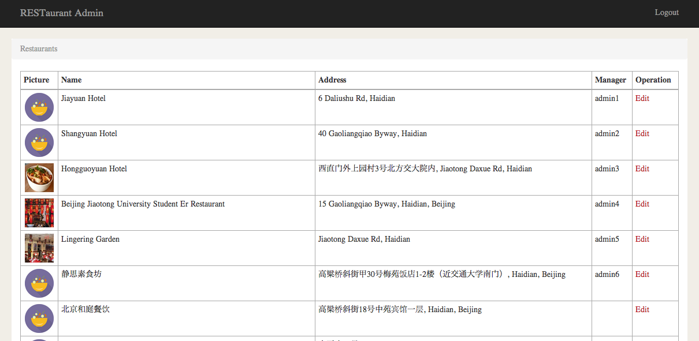
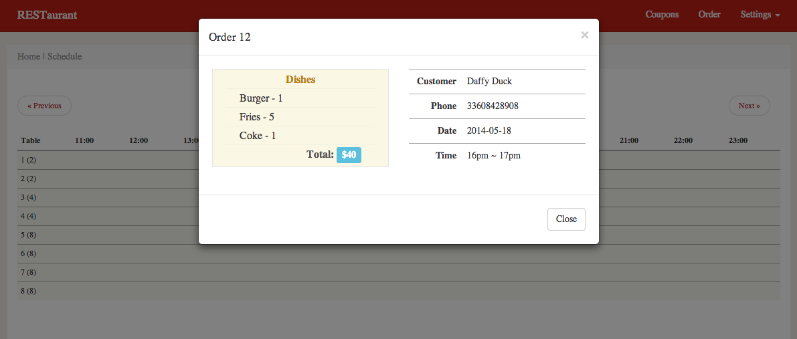

Web frontend & backend for the RESTaurant project.

Introduction
----------

This project is the backend server program to provide RESTful APIs to client and also includes a Web App for restaurant management. The software stack we choose is:

* Node.js for high performance event-driven server
* Redis   for caching (only cache access_token for now)
* MySQL   for persistent datasotre

Deployment
----------

1. Install and start redis server on localhost, default port.

2. Install and start MySQL database.
   * Create a database named "restaurant".
   * Create tables from "ddl.sql".
   * (Optional) Configure you own connection params in "rest-server/utils/database.js".

3. Node.js.
   * install node.js
   * install dependencies: `cd rest-server; npm instal`
   * start the server: `sudo node bin/www`. By default, it's started on localhost:80.

Usage
----------

1. SuperAdmin
   * see list of joined restaurants in "localhost/admin"
   * edit each restaurant
   * add manager account for each restaurant

2. Restaurant manager
   * login at "localhost/manager/login".
   * manage dining tables at "localhost/tables"
   * manage dishes at "localhost/dishes"
   * manage coupons at "localhost/coupons" and push coupons to customers
   * view pending orders at "localhost/orders"
   * accept/deny pending orders
   * view accepted order in schedule table.

Credits
-----------

Some pictures and CSSs are borrowed by [canku](https://github.com/willerce/canku).
